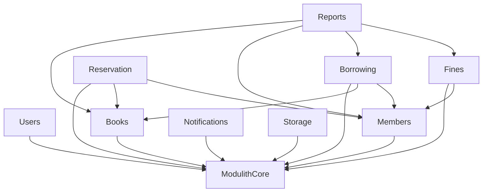

# 图书馆管理系统功能说明与使用指南

本文档基于 `DotNetModulith` 项目框架，描述图书馆管理系统的完整功能、模块划分、API 接口与使用方式。

## 1. 系统概述

图书馆管理系统是一个基于 ASP.NET Core 10 的模块化单体（Modulith）应用，借鉴 Spring Modulith 设计理念，结合 DDD、事件驱动、CQRS 与 OpenTelemetry 可观测性。前端使用 Vue 3 + Naive UI，后端统一返回 `ApiResponse<T>` 格式（HTTP 200 + `code` 区分业务结果）。

### 业务场景

系统覆盖图书馆日常运营的完整流程：

- 图书采购、编目、上架、下架
- 读者注册、会员等级管理
- 图书借阅、归还、续借、丢失处理
- 图书预约、排队、到馆通知
- 逾期罚款、罚款缴纳、豁免
- 通知推送（借阅到期、逾期提醒、预约可借）
- 报表统计（借阅概要、热门图书、逾期报告）

### 技术栈

| 类别     | 技术                                                  |
| -------- | ----------------------------------------------------- |
| 运行时   | .NET 10                                               |
| Web      | ASP.NET Core Controllers + OpenAPI + Vue 3 + Naive UI |
| 认证鉴权 | JWT Bearer + RBAC（用户-角色-权限）                   |
| 数据库   | PostgreSQL + EF Core 10                               |
| 消息     | RabbitMQ + DotNetCore.CAP（含 Outbox）                |
| 调度     | TickerQ（独立数据库 `tickerqdb`）                     |
| 缓存     | FusionCache（L1 内存 + L2 Redis）                     |
| 对象映射 | Riok.Mapperly（编译时）                               |
| 观测     | OpenTelemetry + OpenObserve + OTEL Collector          |
| 日志     | Serilog（Async + JSON）                               |
| 编排     | .NET Aspire                                           |

## 2. 项目结构

```text
src/
  DotNetModulith.Api/                       # API 主机（Program.cs、全局中间件）
  DotNetModulith.AppHost/                   # Aspire 编排入口
  DotNetModulith.JobHost/                   # 定时任务宿主（TickerQ）
  DotNetModulith.MigrationService/          # 数据库迁移服务
  DotNetModulith.ServiceDefaults/           # OTel/健康检查/服务发现默认配置
  DotNetModulith.Abstractions/              # 共享抽象、事件契约、统一响应模型
  DotNetModulith.ModulithCore/              # 模块注册、边界验证、依赖图
  DotNetModulith.Modules.Users/             # 用户与认证模块（后台管理员）
  DotNetModulith.Modules.Books/             # 图书与分类管理模块
  DotNetModulith.Modules.Members/           # 会员管理模块（读者用户）
  DotNetModulith.Modules.Borrowing/         # 借阅管理模块
  DotNetModulith.Modules.Reservation/       # 预约管理模块
  DotNetModulith.Modules.Fines/             # 罚款管理模块
  DotNetModulith.Modules.Notifications/     # 通知管理模块
  DotNetModulith.Modules.Reports/           # 报表统计模块
  DotNetModulith.Modules.Storage/           # 文件存储模块
frontend/
  src/views/                                # Vue 3 前端页面
tests/
  DotNetModulith.ArchitectureTests/         # 架构测试（模块边界、依赖方向）
  DotNetModulith.IntegrationTests/          # 集成测试
```

## 3. 模块依赖关系



## 4. 模块功能详情

### 4.1 Users 模块（后台管理员）

管理后台用户、角色与权限，同时提供认证入口。

**核心功能：**

- 管理员登录（JWT 签发）、登出、修改密码、令牌刷新
- 用户管理：创建、编辑、启用/禁用、强制登出
- 角色管理：创建、编辑、删除角色，分配权限点
- RBAC 权限模型：用户 → 角色 → 权限

**关键 API：**

| 方法   | 路由                           | 说明             | 权限           |
| ------ | ------------------------------ | ---------------- | -------------- |
| POST   | `/api/auth/login`              | 管理员登录       | 匿名           |
| POST   | `/api/auth/logout`             | 管理员登出       | 认证           |
| POST   | `/api/auth/refresh`            | 刷新令牌         | 认证           |
| POST   | `/api/auth/change-password`    | 修改密码         | 认证           |
| GET    | `/api/users`                   | 用户列表（分页） | `users.view`   |
| GET    | `/api/users/{id}`              | 用户详情         | `users.view`   |
| POST   | `/api/users`                   | 创建用户         | `users.manage` |
| PUT    | `/api/users/{id}`              | 编辑用户         | `users.manage` |
| DELETE | `/api/users/{id}`              | 删除用户         | `users.manage` |
| POST   | `/api/users/{id}/force-logout` | 强制登出         | `users.manage` |
| GET    | `/api/roles`                   | 角色列表         | `roles.view`   |
| POST   | `/api/roles`                   | 创建角色         | `roles.manage` |
| PUT    | `/api/roles/{id}`              | 编辑角色         | `roles.manage` |
| DELETE | `/api/roles/{id}`              | 删除角色         | `roles.manage` |

### 4.2 Books 模块（图书与分类管理）

管理图书信息与分类体系。

**核心功能：**

- 图书管理：创建、编辑、删除、查询（支持关键词、分类筛选）
- 分类管理：多级分类树（增删改查）
- 库存管理：总册数、可借册数、馆藏状态（Available/OutOfStock/Disabled）
- 借出/归还操作：`BorrowCopy()` / `ReturnCopy()` 自动更新可借册数与状态

**关键 API：**

| 方法   | 路由                   | 说明             | 权限                |
| ------ | ---------------------- | ---------------- | ------------------- |
| GET    | `/api/books`           | 图书列表（分页） | `books.view`        |
| GET    | `/api/books/{id}`      | 图书详情         | `books.view`        |
| POST   | `/api/books`           | 创建图书         | `books.manage`      |
| PUT    | `/api/books/{id}`      | 编辑图书         | `books.manage`      |
| DELETE | `/api/books/{id}`      | 删除图书         | `books.manage`      |
| GET    | `/api/categories`      | 分类列表（树形） | `categories.manage` |
| POST   | `/api/categories`      | 创建分类         | `categories.manage` |
| PUT    | `/api/categories/{id}` | 编辑分类         | `categories.manage` |
| DELETE | `/api/categories/{id}` | 删除分类         | `categories.manage` |

### 4.3 Members 模块（会员管理）

管理图书馆读者会员。

**核心功能：**

- 会员管理：创建、编辑、查询（支持关键词、状态筛选）
- 会员等级：Regular（普通）/ Premium（高级）/ VIP
- 会员状态：Active（活跃）/ Expired（过期）/ Disabled（禁用）
- 会员有效期管理

**关键 API：**

| 方法   | 路由                | 说明             | 权限             |
| ------ | ------------------- | ---------------- | ---------------- |
| GET    | `/api/members`      | 会员列表（分页） | `members.view`   |
| GET    | `/api/members/{id}` | 会员详情         | `members.view`   |
| POST   | `/api/members`      | 创建会员         | `members.manage` |
| PUT    | `/api/members/{id}` | 编辑会员         | `members.manage` |
| DELETE | `/api/members/{id}` | 删除会员         | `members.manage` |

### 4.4 Borrowing 模块（借阅管理）

管理图书借阅、归还、续借、丢失处理。

**核心功能：**

- 借阅创建：校验会员是否有逾期/罚款，校验图书库存，创建借阅记录
- 归还操作：更新归还日期，释放图书库存
- 续借操作：延长归还期限（最多续借次数可配置）
- 丢失处理：标记借阅记录为丢失，触发罚款事件
- 借阅状态：Borrowed（在借）/ Returned（已还）/ Overdue（逾期）/ Lost（丢失）

**关键 API：**

| 方法 | 路由                             | 说明             | 权限                |
| ---- | -------------------------------- | ---------------- | ------------------- |
| GET  | `/api/borrowings`                | 借阅列表（分页） | `borrowings.view`   |
| GET  | `/api/borrowings/{id}`           | 借阅详情         | `borrowings.view`   |
| GET  | `/api/borrowings/by-member/{id}` | 会员借阅记录     | `borrowings.view`   |
| POST | `/api/borrowings`                | 创建借阅         | `borrowings.manage` |
| POST | `/api/borrowings/{id}/return`    | 归还图书         | `borrowings.manage` |
| POST | `/api/borrowings/{id}/renew`     | 续借             | `borrowings.manage` |
| POST | `/api/borrowings/{id}/mark-lost` | 标记丢失         | `borrowings.manage` |

### 4.5 Reservation 模块（预约管理）

管理图书预约与排队。

**核心功能：**

- 预约创建：会员可预约已借出的图书，自动加入等待队列
- 预约取消：会员或管理员取消预约
- 队列管理：按预约时间排序，图书归还后自动通知首位预约者
- 预约状态：Pending（等待中）/ Fulfilled（已满足）/ Cancelled（已取消）/ Expired（已过期）

**关键 API：**

| 方法   | 路由                               | 说明             | 权限                  |
| ------ | ---------------------------------- | ---------------- | --------------------- |
| GET    | `/api/reservations`                | 预约列表（分页） | `reservations.view`   |
| GET    | `/api/reservations/{id}`           | 预约详情         | `reservations.view`   |
| GET    | `/api/reservations/by-book/{id}`   | 图书预约队列     | `reservations.view`   |
| GET    | `/api/reservations/by-member/{id}` | 会员预约记录     | `reservations.view`   |
| POST   | `/api/reservations`                | 创建预约         | `reservations.manage` |
| DELETE | `/api/reservations/{id}`           | 取消预约         | `reservations.manage` |

### 4.6 Fines 模块（罚款管理）

管理逾期罚款、缴纳与豁免。

**核心功能：**

- 罚款创建：逾期自动生成罚款，管理员手动创建
- 罚款缴纳：标记罚款为已支付
- 罚款豁免：管理员豁免罚款
- 罚款原因：Overdue（逾期）/ Lost（丢失）/ Damage（损坏）/ Other（其他）
- 罚款状态：Unpaid（未缴）/ Paid（已缴）/ Waived（已豁免）

**关键 API：**

| 方法 | 路由                        | 说明             | 权限           |
| ---- | --------------------------- | ---------------- | -------------- |
| GET  | `/api/fines`                | 罚款列表（分页） | `fines.view`   |
| GET  | `/api/fines/{id}`           | 罚款详情         | `fines.view`   |
| GET  | `/api/fines/by-member/{id}` | 会员罚款记录     | `fines.view`   |
| POST | `/api/fines`                | 创建罚款         | `fines.manage` |
| POST | `/api/fines/{id}/pay`       | 缴纳罚款         | `fines.manage` |
| POST | `/api/fines/{id}/waive`     | 豁免罚款         | `fines.manage` |

### 4.7 Notifications 模块（通知管理）

管理系统通知推送。

**核心功能：**

- 通知创建：系统事件触发通知（借阅到期、逾期提醒、预约可借、罚款通知）
- 通知查询：按收件人、已读状态筛选
- 标记已读：单条/批量标记已读
- 未读数查询：获取当前用户未读通知数

**通知类型：**

| 类型                 | 说明         |
| -------------------- | ------------ |
| BorrowDue            | 借阅即将到期 |
| Overdue              | 借阅已逾期   |
| ReservationAvailable | 预约可借     |
| FineIssued           | 罚款通知     |
| System               | 系统通知     |

**关键 API：**

| 方法 | 路由                              | 说明             | 权限                   |
| ---- | --------------------------------- | ---------------- | ---------------------- |
| GET  | `/api/notifications`              | 通知列表（分页） | `notifications.view`   |
| GET  | `/api/notifications/{id}`         | 通知详情         | `notifications.view`   |
| POST | `/api/notifications`              | 创建通知         | `notifications.manage` |
| POST | `/api/notifications/{id}/read`    | 标记已读         | `notifications.view`   |
| POST | `/api/notifications/read-all`     | 全部已读         | `notifications.view`   |
| GET  | `/api/notifications/unread-count` | 未读数量         | `notifications.view`   |

### 4.8 Reports 模块（报表统计）

提供跨模块数据聚合与统计报表。

**核心功能：**

- 借阅概要：总借阅量、在借中、逾期中、今日归还、未缴罚款总额、待缴罚款数
- 热门图书：按借阅次数排序的 TOP N 图书
- 逾期报告：逾期借阅记录列表（含逾期天数、会员信息、图书信息）
- 借阅趋势：指定日期范围的每日借阅/归还数量

**关键 API：**

| 方法 | 路由                         | 说明             | 权限           |
| ---- | ---------------------------- | ---------------- | -------------- |
| GET  | `/api/reports/statistics`    | 借阅概要统计     | `reports.view` |
| GET  | `/api/reports/popular-books` | 热门图书 TOP N   | `reports.view` |
| GET  | `/api/reports/overdue`       | 逾期报告（分页） | `reports.view` |
| GET  | `/api/reports/daily-trend`   | 借阅趋势         | `reports.view` |

### 4.9 Storage 模块（文件存储）

基于 S3 兼容存储（RustFS）的文件上传与管理。

**关键 API：**

| 方法   | 路由                          | 说明     | 权限             |
| ------ | ----------------------------- | -------- | ---------------- |
| POST   | `/api/storage/upload`         | 上传文件 | `storage.manage` |
| GET    | `/api/storage/download/{key}` | 下载文件 | `storage.manage` |
| DELETE | `/api/storage/{key}`          | 删除文件 | `storage.manage` |

### 4.10 Modules 治理

模块元数据查询与依赖图可视化。

**关键 API：**

| 方法 | 路由                  | 说明           | 权限           |
| ---- | --------------------- | -------------- | -------------- |
| GET  | `/api/modules`        | 已注册模块列表 | `modules.view` |
| GET  | `/api/modules/graph`  | 模块依赖图     | `modules.view` |
| GET  | `/api/modules/verify` | 模块边界校验   | `modules.view` |

## 5. 认证鉴权

### 5.1 认证流程

1. 管理员通过 `POST /api/auth/login` 登录，获取 JWT 访问令牌
2. 后续请求在 `Authorization` 头中携带 `Bearer {token}`
3. 系统校验 JWT 签名 → 校验会话有效性 → 注入实时权限声明

### 5.2 RBAC 权限模型

采用标准的三层模型：

- **用户（User）**：后台管理员
- **角色（Role）**：如 Admin、Librarian
- **权限（Permission）**：如 `books.view`、`members.manage`

权限点完整列表：

| 权限码                 | 说明         |
| ---------------------- | ------------ |
| `users.view`           | 查看用户     |
| `users.manage`         | 管理用户     |
| `roles.view`           | 查看角色     |
| `roles.manage`         | 管理角色     |
| `books.view`           | 查看图书     |
| `books.manage`         | 管理图书     |
| `books.import`         | 批量导入图书 |
| `books.barcode`        | 条码管理     |
| `categories.manage`    | 管理分类     |
| `members.view`         | 查看会员     |
| `members.manage`       | 管理会员     |
| `member-groups.manage` | 管理会员分组 |
| `borrowings.view`      | 查看借阅     |
| `borrowings.manage`    | 管理借阅     |
| `borrowing-rules`      | 借阅规则管理 |
| `reservations.view`    | 查看预约     |
| `reservations.manage`  | 管理预约     |
| `fines.view`           | 查看罚款     |
| `fines.manage`         | 管理罚款     |
| `fines-rules`          | 罚款规则管理 |
| `notifications.view`   | 查看通知     |
| `notifications.manage` | 管理通知     |
| `reports.view`         | 查看报表     |
| `storage.manage`       | 管理文件存储 |
| `audit.view`           | 查看审计日志 |
| `modules.view`         | 查看模块信息 |

### 5.3 令牌失效机制

系统同时使用两套令牌失效机制：

- **会话表撤销**：登出、强制登出、修改密码时撤销会话记录
- **TokenVersion 失效**：密码变更、禁用用户时提升 TokenVersion，所有旧 Token 立即失效

## 6. 数据库拓扑

- **业务数据库** `modulithdb`：所有业务模块共用，通过 Schema 隔离（`books`、`members`、`borrowing`、`reservation`、`fines`、`notifications`、`users`）
- **调度数据库** `tickerqdb`：TickerQ 定时任务独立数据库

## 7. 前端功能

前端使用 Vue 3 + TypeScript + Naive UI + Vite 构建，提供以下页面：

| 页面     | 路由             | 功能说明                   |
| -------- | ---------------- | -------------------------- |
| 登录     | `/login`         | 管理员登录，含图形验证码   |
| 仪表盘   | `/dashboard`     | 系统概览与关键指标         |
| 用户管理 | `/users`         | 后台管理员 CRUD + 角色分配 |
| 角色管理 | `/roles`         | 角色管理 + 权限点分配      |
| 图书管理 | `/books`         | 图书 CRUD + 分类筛选       |
| 分类管理 | `/categories`    | 多级分类树管理             |
| 会员管理 | `/members`       | 读者会员 CRUD + 状态管理   |
| 借阅管理 | `/borrowings`    | 借阅/归还/续借/标记丢失    |
| 预约管理 | `/reservations`  | 预约创建/取消/队列查看     |
| 罚款管理 | `/fines`         | 罚款创建/缴纳/豁免         |
| 通知管理 | `/notifications` | 通知列表/标记已读/全部已读 |
| 报表统计 | `/reports`       | 借阅概要/热门图书/逾期报告 |

## 8. 快速启动

### 8.1 前置条件

- .NET 10 SDK
- Docker Desktop
- Node.js 18+

### 8.2 启动后端

推荐通过 Aspire 一键启动全部依赖：

```bash
dotnet restore
dotnet run --project src/DotNetModulith.AppHost
```

启动后 Aspire Dashboard 中可查看各服务端点（默认 `http://localhost:15000`）。

Aspire 自动启动的依赖：
- `modulithdb`（PostgreSQL 业务库）
- `tickerqdb`（TickerQ 调度库）
- `rabbitmq`（消息队列）
- `redis`（缓存）
- `rustfs`（S3 兼容存储）
- `openobserve`（可观测平台）
- `otel-collector`（遥测收集器）

### 8.3 启动前端

```bash
cd frontend
npm install
npm run dev
```

前端开发服务器默认运行在 `http://localhost:5173`。

### 8.4 初始管理员

系统首次启动后需要初始化管理员账号。通过 `MigrationService` 自动执行种子数据创建。

## 9. 统一响应格式

所有接口（成功/失败）均返回 `HTTP 200`，通过 `code` 区分业务结果：

```json
{
  "msg": "success",
  "code": 200,
  "data": {}
}
```

- `msg`：结果描述
- `code`：业务码（200 成功，其他为错误码）
- `data`：业务数据或错误详情

完整错误码对照见 `docs/api-error-codes.md`。

## 10. 模块间通信

模块间通信遵循 Spring Modulith 设计理念，分为两种模式：

| 模式             | 适用场景               | 实现                  |
| ---------------- | ---------------------- | --------------------- |
| 事件驱动（异步） | 最终一致性、跨模块解耦 | CAP + RabbitMQ Outbox |
| 同步调用         | 实时校验、事务内操作   | DI 注入公开 API 接口  |

详细规则见 `docs/module-communication.md`。

## 11. 开发规范

项目遵循统一的开发规范，包括命名、目录组织、API 设计、校验、对象映射、测试等。详见 `docs/development-standards.md`。

关键约定：

- 数据库实体统一 `*Entity` 后缀
- 请求/响应模型：`*Request` / `*Response`
- 命令/查询：`*Command` / `*Query`，处理器 `*Handler`
- 所有接口返回 `ApiResponse<T>`
- 对象映射使用 Mapperly（编译时）
- 模块间通信通过事件驱动或公开 API 接口

## 12. 相关文档

| 文档                            | 说明                     |
| ------------------------------- | ------------------------ |
| `docs/auth-rbac.md`             | 认证鉴权与 RBAC 详细说明 |
| `docs/api-error-codes.md`       | API 错误码对照表         |
| `docs/development-standards.md` | 项目开发规范             |
| `docs/module-communication.md`  | 模块间通信规范           |
| `docs/scheduled-jobs.md`        | 定时任务开发说明         |
